# AgentSkills.io Farming Skills

Open source AgentSkills.io format skills for farmers.

---

## Mission

Provide farmers with open source AI skills that automate agricultural operations, support natural farming methods, and enable autonomous farm management.

---

## About AgentSkills.io

AgentSkills is a skill format for autonomous AI assistants. Skills extend AI capabilities with specialized knowledge, tools, and behaviors for specific domains.

---

## Skill Directory Structure

Each skill is a self-contained directory with all necessary files:

```
skill-name/
├── SKILL.md              # Skill definition and instructions
├── tools.json            # Tool configurations (optional)
├── .env.example          # Environment variables template for credentials
├── scripts/              # Helper scripts and utilities
├── examples/             # Example outputs and use cases
├── references/           # Documentation and reference materials
└── resources/           # Templates, configs, data files
```

---

## SKILL.md Format

Each skill must include a `SKILL.md` file that follows this structure:

```markdown
# Skill Name

Brief description of what this skill does.

## Purpose

Detailed explanation of skill's purpose and goals.

## Capabilities

List of specific capabilities and use cases.

## Instructions

How to AI agent should use this skill.

## Tools

Any tools this skill uses or requires.

## Environment Variables

Required credentials or configuration (see .env.example).

## Examples

Example usage scenarios.

## References

Links to documentation, research, or external resources.
```

---

## .env.example Format

Each skill should include a `.env.example` file that documents required credentials and configuration:

```bash
# Weather API Key (optional - uses wttr.in by default)
WEATHER_API_KEY=your_api_key_here

# Soil database API (optional)
SOIL_DB_API_KEY=your_api_key_here

# Local configuration
SKILL_DEBUG=false
SKILL_LOG_LEVEL=info
```

Usage:
```bash
# Copy example to create actual .env file
cp .env.example .env

# Edit with your credentials
nano .env

# .env is in .gitignore - never commit actual credentials
```

---

## tools.json Format

Optional JSON file defining tool configurations:

```json
{
  "name": "skill-name",
  "version": "1.0.0",
  "tools": [
    {
      "name": "check_weather",
      "description": "Check current weather conditions",
      "command": "weather-check",
      "params": ["location", "units"]
    }
  ],
  "dependencies": [
    {"name": "curl", "required": true},
    {"name": "jq", "required": false}
  ]
}
```

---

## Skill Categories

This repository contains skills for following agricultural domains:

- **Weather Monitoring** - Real-time weather tracking, freeze alerts, thaw windows
- **Farm Rehabilitation** - Post-freeze damage assessment and recovery
- **JADAM Natural Farming** - Ferment-based inputs, JWA, JLF, JLF+, WCA
- **Worm Farming** - Bin setup, feeding, health monitoring, harvesting
- **Ferments & Inputs** - Recipes, protocols, temperature tracking, batch logs
- **Crop Management** - Planting schedules, growth tracking, health monitoring
- **IoT & Sensors** - Sensor deployment, data collection, automated alerts
- **Documentation** - Daily logs, reports, seasonal planning
- **Image Generation** - AI-powered visual content creation for marketing, documentation, and educational materials

---

## Featured Skills

### Nano Banana Image Generator

Google Gemini 2.5 Flash Image (Nano Banana) model for generating, editing, and creating AI-powered visual content including infographics, product photos, illustrations, and more.

**Capabilities:**
- Generate images from natural language descriptions
- Create multi-panel infographics with data visualizations
- Edit existing images with text prompts
- Multiple aspect ratios and resolutions (1K, 2K, 4K)
- Multi-turn conversations for iterative refinement
- Google Search grounding for real-time data
- Character consistency across multiple images

**Use Case:** Create professional agricultural infographics, product photography for marketing, educational diagrams for extension materials, and technical illustrations without hiring designers.

---

---

## Skills

### Tier 1: Industrial Operations (5,000+ acres)

#### 1. Universal Equipment Translator

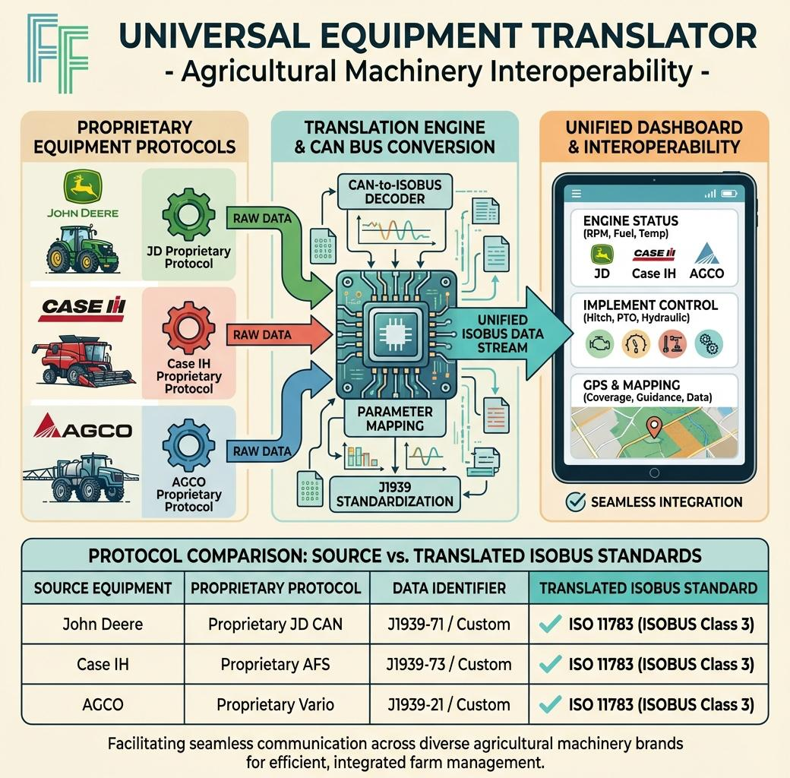

Enables mixed-fleet equipment interoperability by translating between proprietary agricultural equipment protocols. Works with John Deere, Case IH, AGCO, and other major brands using ISO 11783/ISOBUS standards.

**Capabilities:**
- Translate between proprietary protocols and ISOBUS
- Support multiple manufacturer equipment simultaneously
- Real-time CAN bus message translation
- Cross-brand fleet coordination
- Offline operation with cached translations
- Open-source alternative to dealer software

**Use Case:** Farmers with mixed-brand equipment (John Deere tractors, Case IH planters, AGCO sprayers) can now operate all equipment from a single unified interface without expensive dealer software subscriptions.

---

#### 2. Emergency Diagnostics Liberator

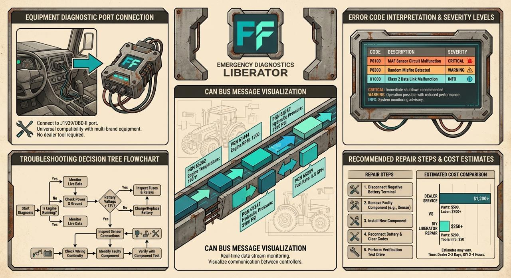

Emergency equipment diagnostics without dealer tools, providing farmers with immediate access to diagnostic information, error code interpretation, and repair guidance when equipment fails during critical operations.

**Capabilities:**
- Real-time CAN bus diagnostics
- Error code interpretation without dealer tools
- Repair guidance and troubleshooting steps
- Offline operation with cached diagnostic data
- Support for multiple equipment brands
- Emergency repair cost estimation

**Use Case:** When equipment fails during critical harvest or planting window and dealer support is unavailable, farmers can immediately diagnose issues, understand error codes, and make informed repair decisions.

---

#### 3. Data Synthesis Dashboard

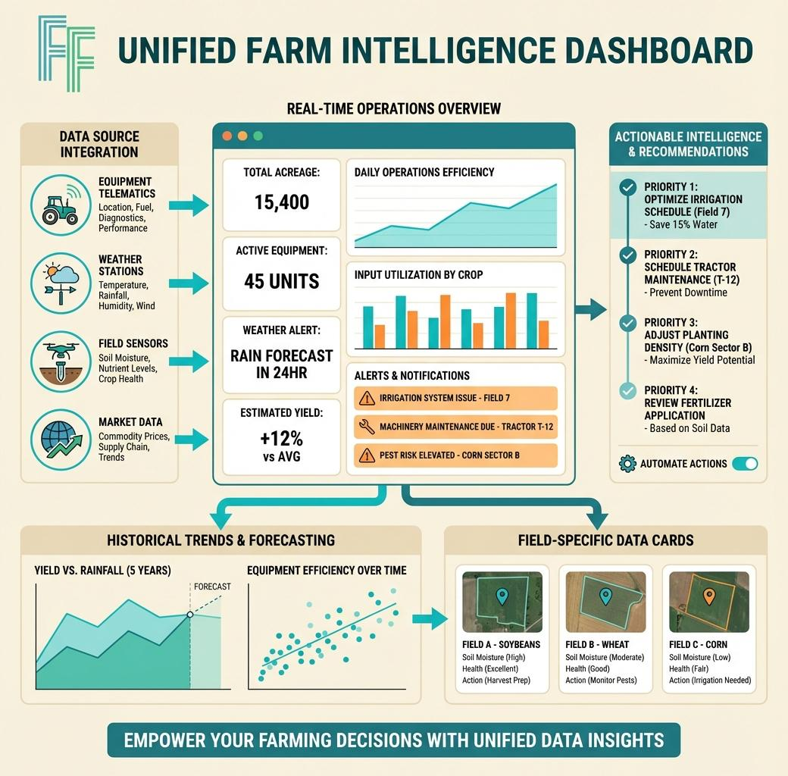

Unified dashboard that synthesizes equipment, weather, operations, and farm data into actionable intelligence for agricultural decision-making.

**Capabilities:**
- Real-time data aggregation from multiple sources
- Unified KPIs and performance metrics
- Actionable recommendations based on data analysis
- Field-specific reports and historical trends
- Equipment status and performance monitoring
- Weather forecasts with operational recommendations
- Mobile-friendly interface for field access
- Customizable dashboards and widgets

**Use Case:** Farmers currently check multiple systems for data - GPS guidance on one screen, yield monitor on another, weather on a tablet. This skill provides a single unified dashboard with all critical information and actionable intelligence for informed decisions.

---

#### 4. Subscription Cost Eliminator

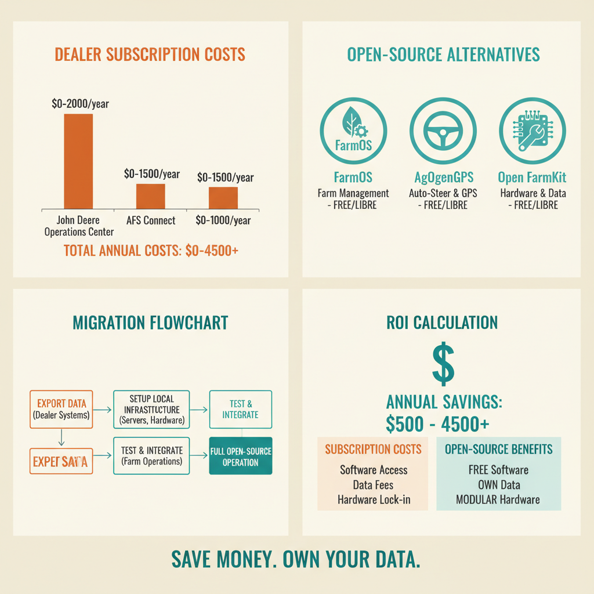

Eliminate dealer subscription services and cloud dependencies by building open-source alternatives and self-hosted solutions for agricultural equipment and software.

**Capabilities:**
- Audit all subscription dependencies and costs
- Identify open-source alternatives to paid services
- Migrate data from dealer systems to local infrastructure
- Set up self-hosted dashboards and analysis tools
- Calculate ROI and annual savings
- Eliminate ongoing subscription fees
- Maintain data sovereignty

**Use Case:** Farmers paying thousands annually for dealer subscriptions (John Deere Operations Center $500-2000/year, Case IH AFS $600-1500/year, Climate FieldView $300-1000/year) can eliminate these costs with open-source alternatives like FarmOS, AgOpenGPS, and Open FarmKit, saving $2,000-5,000 per year.

---

#### 5. Downtime Cost Calculator

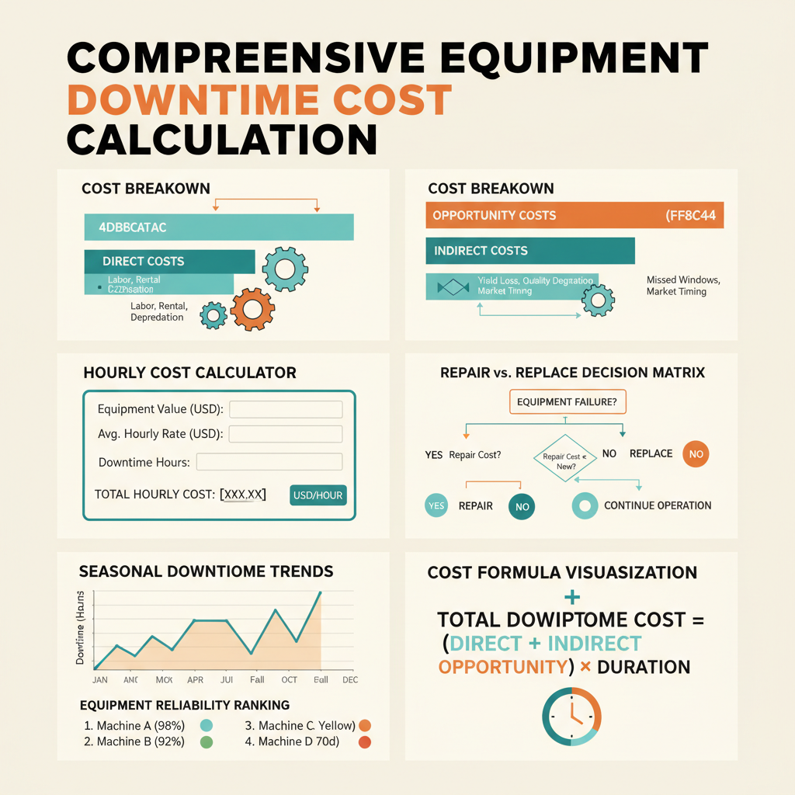

Calculate and analyze the true cost of equipment downtime, enabling farmers to make informed decisions about repair, replacement, and preventive maintenance investments.

**Capabilities:**
- Calculate hourly downtime costs including direct, indirect, and opportunity costs
- Analyze yield loss, quality degradation, and soil compaction
- Compare repair costs vs downtime costs
- Generate cost-benefit analysis for preventive maintenance
- Track downtime patterns and identify problematic equipment
- Calculate ROI of maintenance investments
- Create reports for insurance and warranty claims

**Use Case:** When equipment fails during critical harvest window, farmers can accurately calculate total costs including direct labor/rental costs, indirect yield/quality impacts, and opportunity costs of missed optimal timing to make informed repair vs replace decisions.

---

#### 6. Fleet Intelligence Coordinator

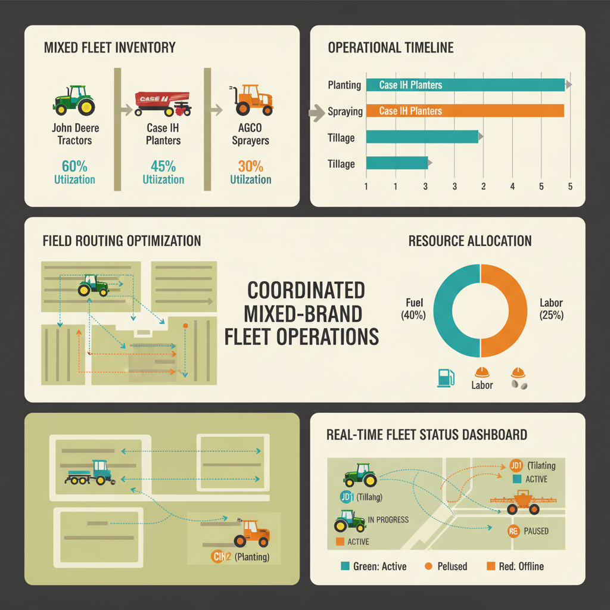

Coordinate mixed-brand equipment fleet operations for optimal efficiency and utilization across large-scale operations.

**Capabilities:**
- Real-time fleet scheduling and routing
- Multi-brand equipment coordination (John Deere, Case IH, AGCO)
- Resource allocation optimization (fuel, labor, inputs)
- Equipment utilization tracking and analysis
- Field routing optimization
- Real-time fleet status dashboard
- Cross-brand communication support

**Use Case:** Large-scale farms with mixed-brand equipment can optimize scheduling, routing, and resource allocation across all equipment regardless of manufacturer, improving utilization and reducing idle time.

---

#### 7. Regulatory Compliance Autopilot

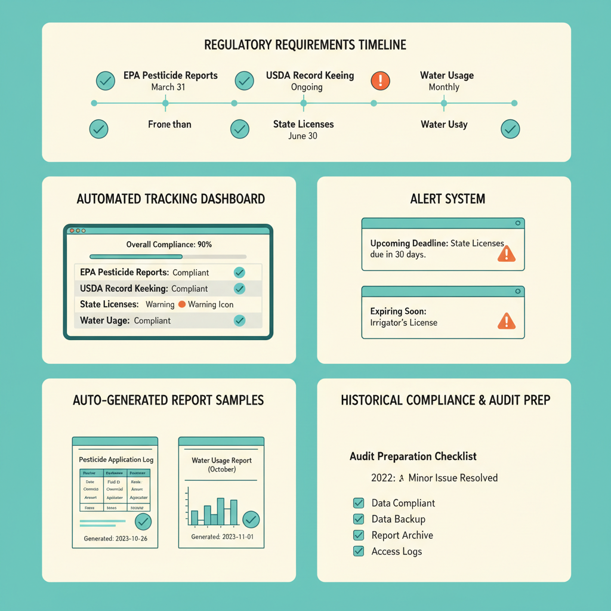

Automate regulatory reporting and compliance tracking for agricultural operations, including EPA, USDA, and state requirements.

**Capabilities:**
- Track all regulatory requirements (EPA, USDA, state licenses)
- Automated compliance status monitoring
- Alert system for deadlines and expiring licenses
- Auto-generate required reports (pesticide logs, water usage)
- Historical compliance records
- Audit preparation support
- Multi-jurisdiction support

**Use Case:** Farmers can automatically track all regulatory requirements, receive alerts for upcoming deadlines, and generate required compliance reports without manual record-keeping or risk of missed requirements.

---

#### 8. Vendor Lock-In Escape Kit

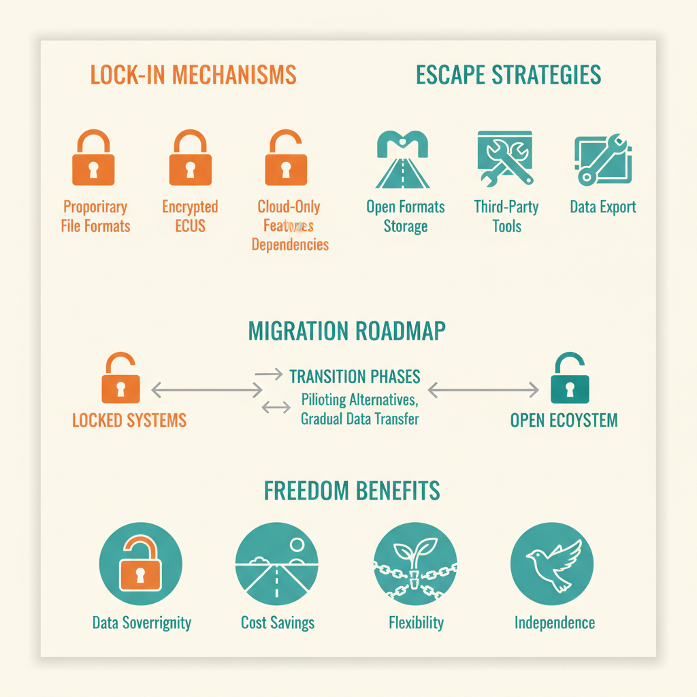

Tools and strategies to escape vendor lock-in from equipment and software providers, regaining data sovereignty and reducing dependency costs.

**Capabilities:**
- Identify lock-in mechanisms (proprietary formats, encrypted ECUs, cloud-only)
- Provide escape strategies and open alternatives
- Data export from proprietary systems
- Local infrastructure setup
- Migration roadmaps
- Freedom benefits analysis (data sovereignty, cost savings)
- Open format adoption

**Use Case:** Farmers locked into proprietary dealer ecosystems can escape by identifying lock-in mechanisms, implementing open alternatives, and maintaining their data locally, saving thousands annually and regaining full control.

---

#### 9. Actual vs Promised Validator

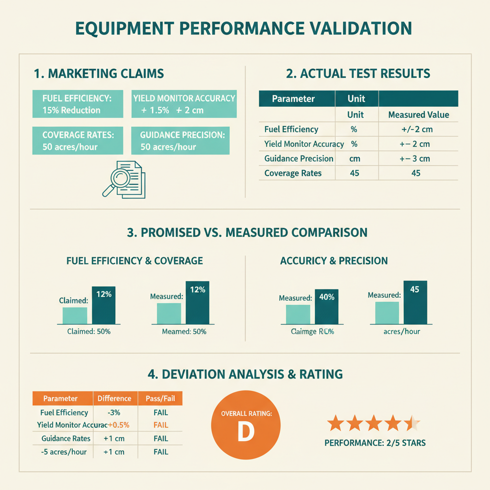

Validate equipment performance against marketing claims and specifications, providing accurate performance verification.

**Capabilities:**
- Compare claimed vs actual performance metrics
- Test fuel efficiency, accuracy, precision, coverage rates
- Generate deviation analysis and pass/fail indicators
- Performance rating system
- Side-by-side comparison charts
- Warranty claim support documentation
- Evidence for equipment selection

**Use Case:** Farmers can verify that equipment actually performs as marketed (fuel efficiency, yield monitor accuracy, guidance precision) before purchase or during warranty claims, preventing costly purchases of underperforming equipment.

---

#### 10. Critical Timing Optimizer

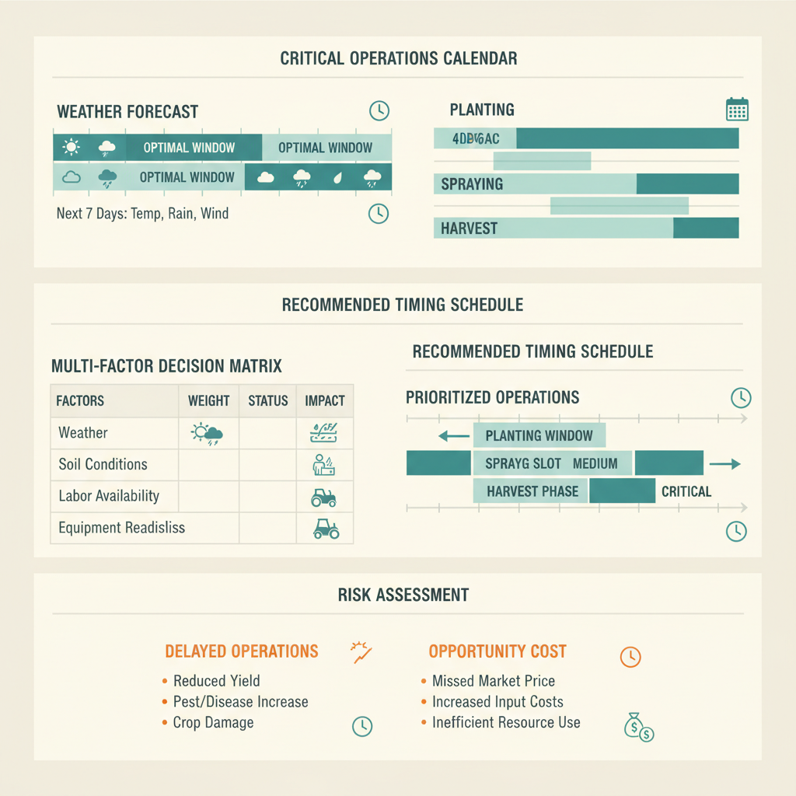

Optimize critical operations timing for weather conditions and operational efficiency, maximizing yield and minimizing risk.

**Capabilities:**
- Weather forecast analysis for optimal windows
- Multi-factor decision matrices (weather, soil, labor, equipment)
- Critical operations calendar with time constraints
- Risk assessment for delayed operations
- Opportunity cost calculation
- Actionable timing recommendations
- Historical window optimization

**Use Case:** Farmers can identify optimal planting, spraying, and harvest windows based on weather forecasts, soil conditions, and operational factors, maximizing yield and minimizing risk of missed critical windows.

---

### Tier 2: Mid-Size Production Farms (100-2,000 acres)

#### 11. Plug and Play Precision Agriculture

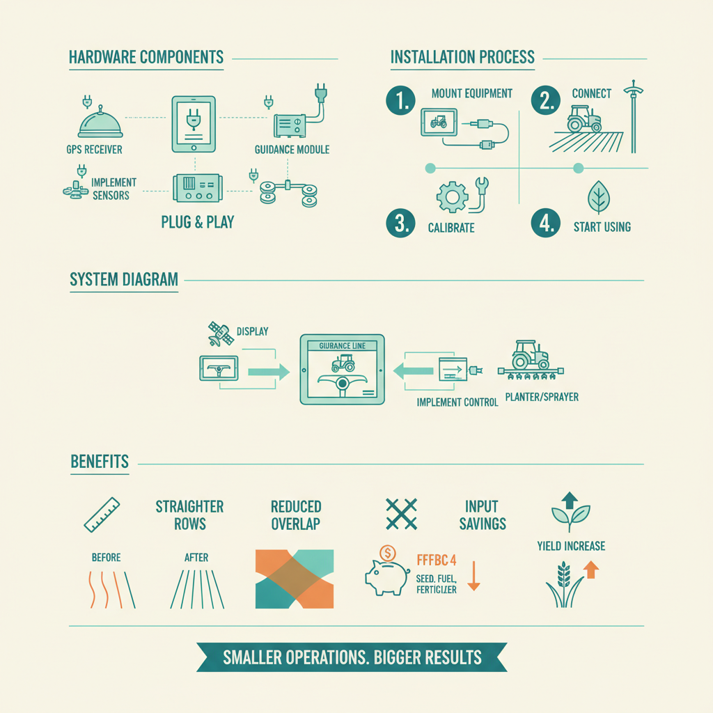

Simple, affordable precision agriculture setup for smaller operations that works out of the box without technical expertise.

**Capabilities:**
- Easy installation with plug-and-play components
- Hardware compatibility with multiple brands
- Simplified setup without technical expertise
- Straighter rows and reduced overlap
- Input savings and yield increase
- Affordable pricing
- Works out of the box

**Use Case:** Small farmers can implement precision agriculture without expensive systems, technical expertise, or complex setup - just plug in components and start using.

---

#### 12. Mixed Fleet Coordinator

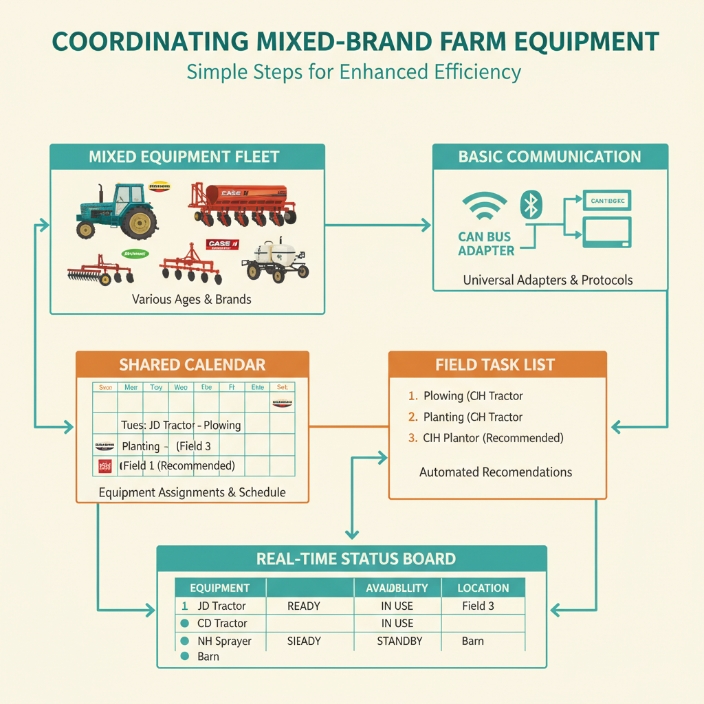

Coordinate mixed-brand smaller equipment for efficient operations with basic communication and data sharing.

**Capabilities:**
- Basic equipment communication setup
- Shared calendar view
- Equipment assignment recommendations
- Simple status board
- Field task lists
- Multi-brand coordination
- Basic data sharing

**Use Case:** Small operations with mixed-brand equipment can coordinate basic operations without expensive systems, improving scheduling and efficiency.

---

#### 13. Repair Decision Assistant

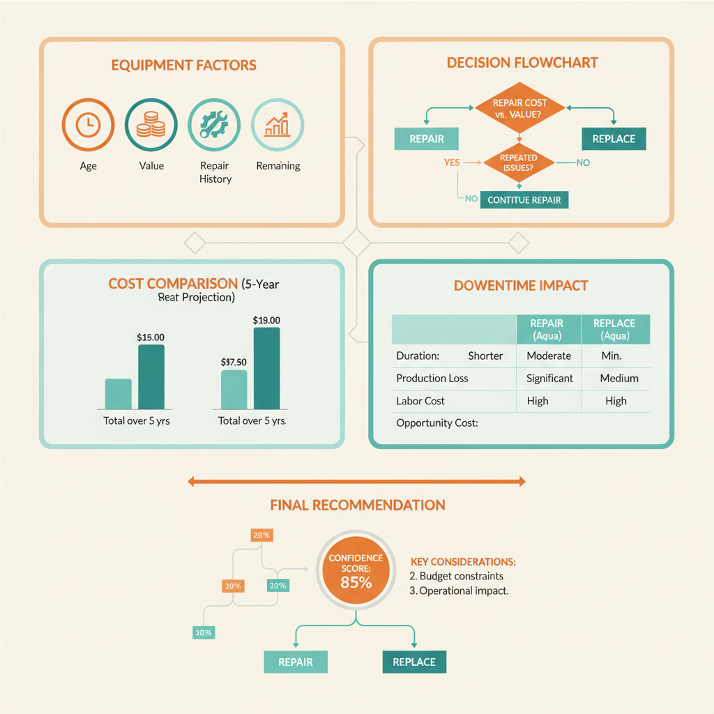

Help farmers make informed repair vs replace decisions for equipment using comprehensive analysis of costs, age, and utilization.

**Capabilities:**
- Analyze equipment factors (age, value, repair history, remaining life)
- Repair vs replace cost comparison
- Decision flowcharts with yes/no paths
- Downtime impact analysis
- Confidence scores and recommendations
- 5-year cost projections
- Risk assessment

**Use Case:** Farmers facing equipment repair can make informed decisions by comparing repair costs to equipment value, analyzing historical repairs, and projecting 5-year costs of both options.

---

#### 14. Actionable Weather Alerts

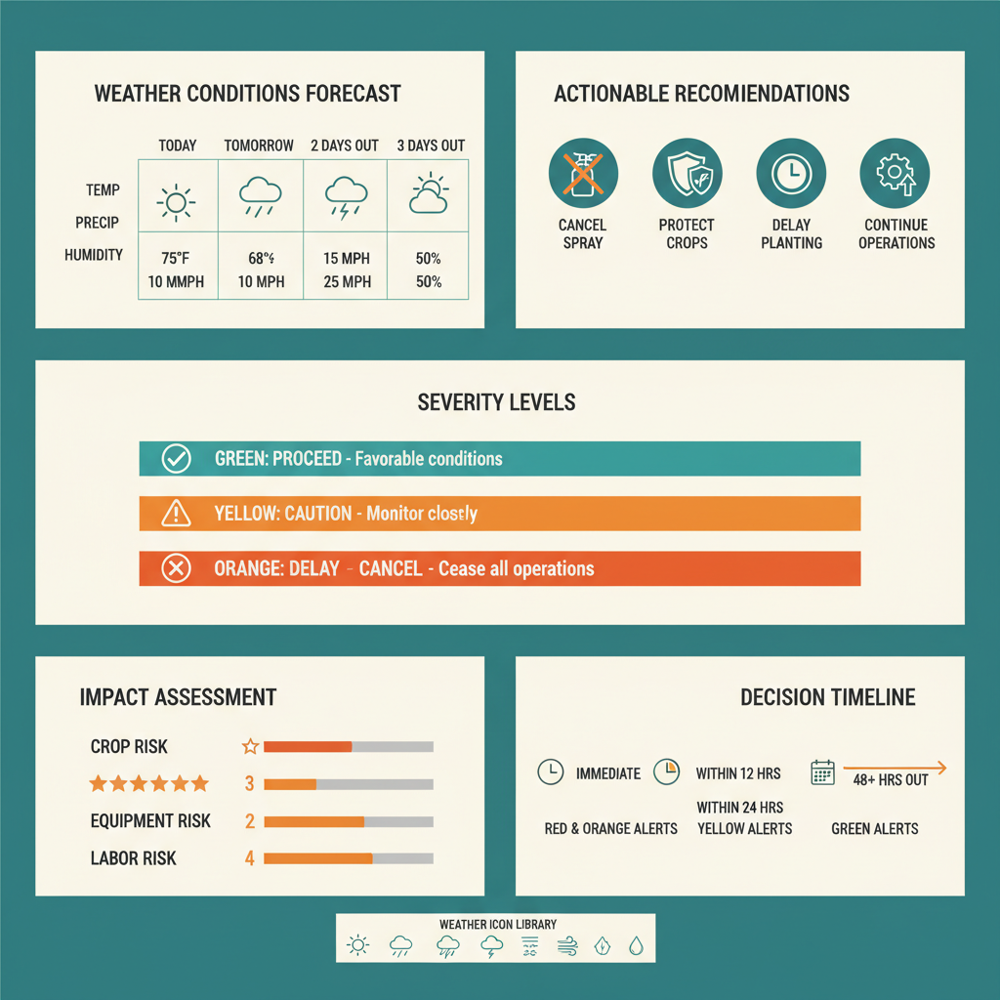

Weather alerts with specific, actionable recommendations for farm operations - not generic forecasts but specific guidance on when to spray, plant, or protect.

**Capabilities:**
- Weather condition analysis
- Specific actionable recommendations
- Severity level indicators (proceed, caution, delay, cancel)
- Impact assessment (crop, equipment, labor)
- Decision timelines
- Weather icon library
- Real-time alerts

**Use Case:** Farmers receive specific actions (Cancel spray application, rain in 3 hours) rather than generic forecasts (Chance of rain), enabling better operational decisions.

---

#### 15. Input Cost Opportunist

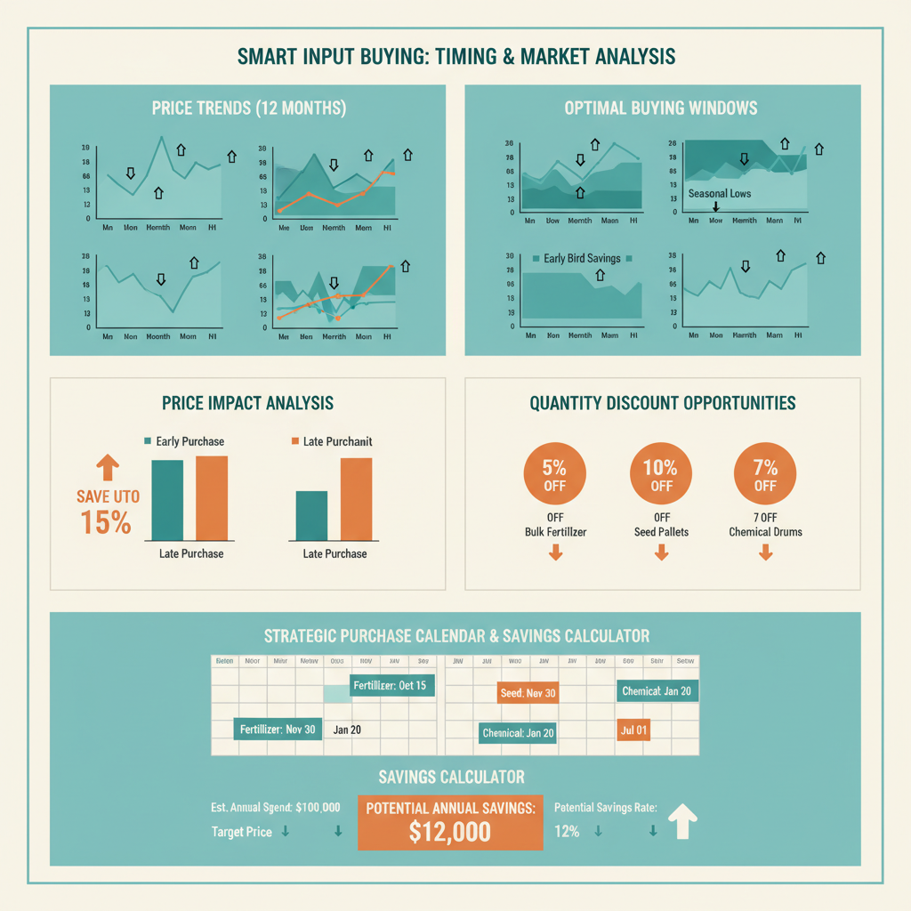

Find opportunities for input cost savings through timing and market analysis, identifying optimal buying windows for fertilizer, seed, chemicals, and fuel.

**Capabilities:**
- Monitor price trends (fertilizer, seed, chemicals, fuel)
- Identify optimal buying windows
- Calculate early vs late purchase savings
- Quantity discount opportunities
- Purchase calendar with target prices
- Annual savings calculator
- Market trend analysis

**Use Case:** Farmers can identify optimal buying times and save 30-50% on inputs by timing purchases when prices are lowest, avoiding seasonal price spikes.

---

#### 16. Field History Intelligence


Track and analyze field history data for informed decisions, maintaining comprehensive records of yield, inputs, pests, soil tests, and operations.

**Capabilities:**
- Track all field data categories (yield, inputs, pests, soil tests, weather, operations)
- Data visualization (yield maps, soil test trends, pest patterns)
- Extract intelligence insights (best varieties, optimal timing, problem areas)
- Historical data preservation
- Decision support from history
- Multi-season analysis
- Data layering for comprehensive view

**Use Case:** Farmers maintain comprehensive field history and extract insights to make informed decisions about varieties, timing, and inputs based on historical performance.

---

#### 17. Local Market Connector

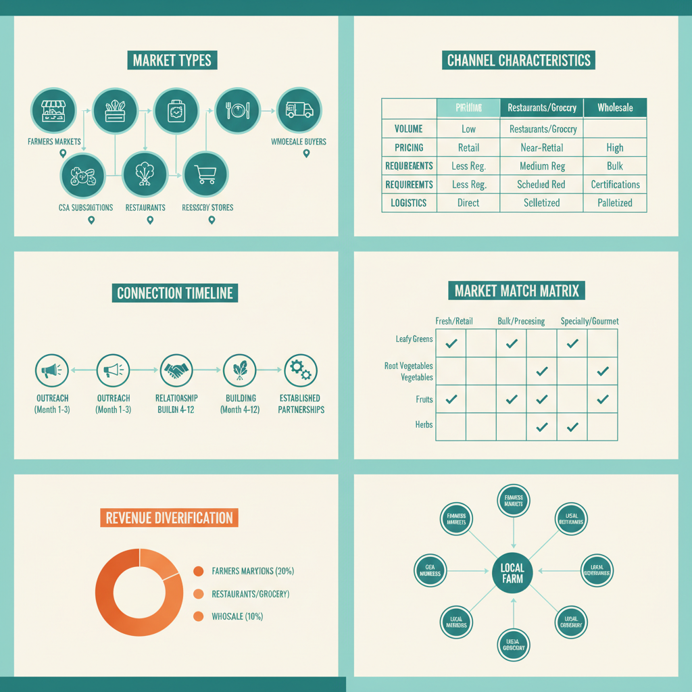

Connect farmers with local markets, buyers, and selling opportunities including farmers markets, CSA subscriptions, restaurants, and wholesale buyers.

**Capabilities:**
- Market type identification (farmers markets, CSA, restaurants, wholesale)
- Channel characteristics and requirements
- Connection timelines and relationship building
- Market match matrix (crop types to buyer needs)
- Revenue diversification analysis
- Multi-channel support
- Local market network

**Use Case:** Farmers connect with diverse local markets and buyers, creating multiple revenue streams and reducing dependency on single market channels.

---

#### 18. Grant Money Finder

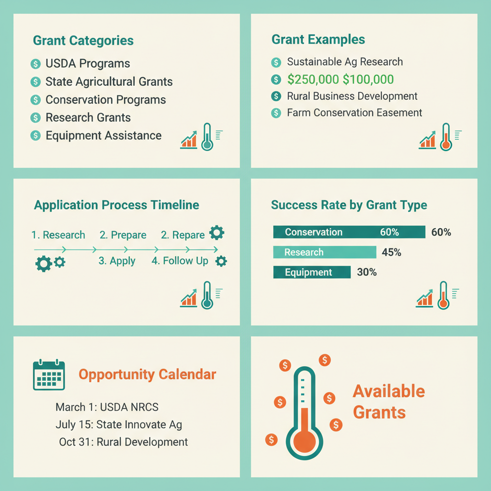

Find agricultural grants and funding opportunities including USDA programs, state agricultural grants, conservation programs, and research grants.

**Capabilities:**
- Grant category tracking (USDA, state, conservation, research, equipment)
- Grant examples with funding amounts
- Application process timelines
- Success rate analysis by grant type
- Opportunity calendar with deadlines
- Application guidance
- Funding thermometers

**Use Case:** Farmers find and track grant funding opportunities with application deadlines, success rates, and guidance for complex application processes.

---

#### 19. Invisible Data Logger

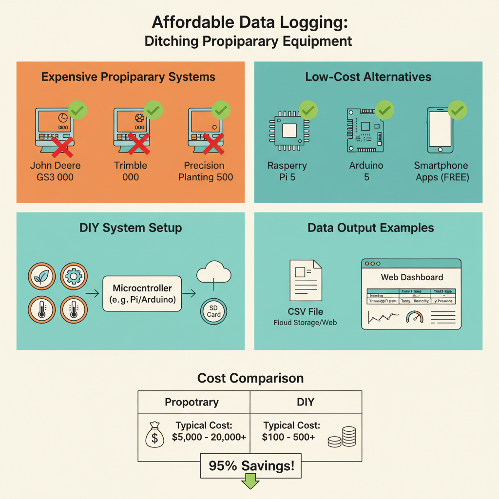

Log farm data without expensive proprietary equipment using low-cost alternatives like Raspberry Pi, Arduino, and smartphone apps.

**Capabilities:**
- Low-cost data logging alternatives
- Hardware options (Raspberry Pi, Arduino, smartphone)
- System setup (sensors to microcontroller to storage)
- Data output in standard formats (CSV, web dashboards)
- 95%+ cost savings vs proprietary systems
- Open-source solutions
- Self-hosted storage

**Use Case:** Small farmers can log farm data without expensive proprietary equipment (John Deere GS3 $3000, Trimble $5000) using low-cost alternatives (Raspberry Pi $35, Arduino $25, free smartphone apps), saving thousands.

---

#### 20. One Screen Mission Control

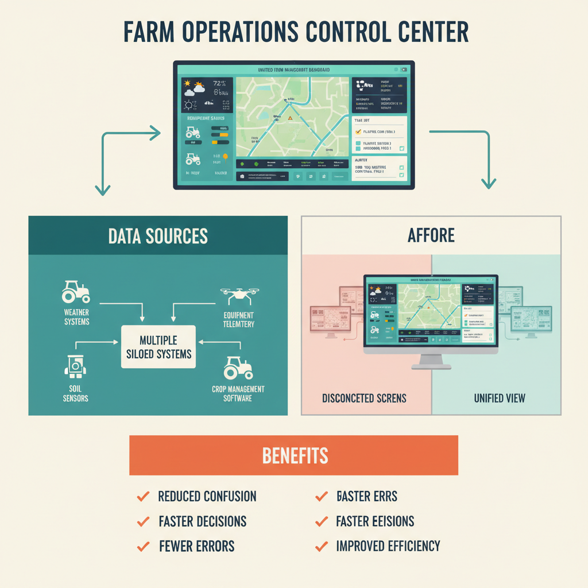

Single-screen operations control center for farm management, unifying GPS guidance, weather, equipment status, tasks, and alerts.

**Capabilities:**
- Unified dashboard with all critical information
- GPS guidance display
- Weather monitoring
- Equipment status tracking
- Task list and scheduling
- Alert system
- Mobile-friendly interface
- Single-screen access

**Use Case:** Farmers currently check multiple systems (GPS on one screen, yield monitor on another, weather on tablet, equipment on phone) - this provides a single unified dashboard with all critical information and actionable intelligence.

---

### Tier 3: Small Farmers and Homesteaders (<5 acres)

#### 21. Plant Whisperer Assistant

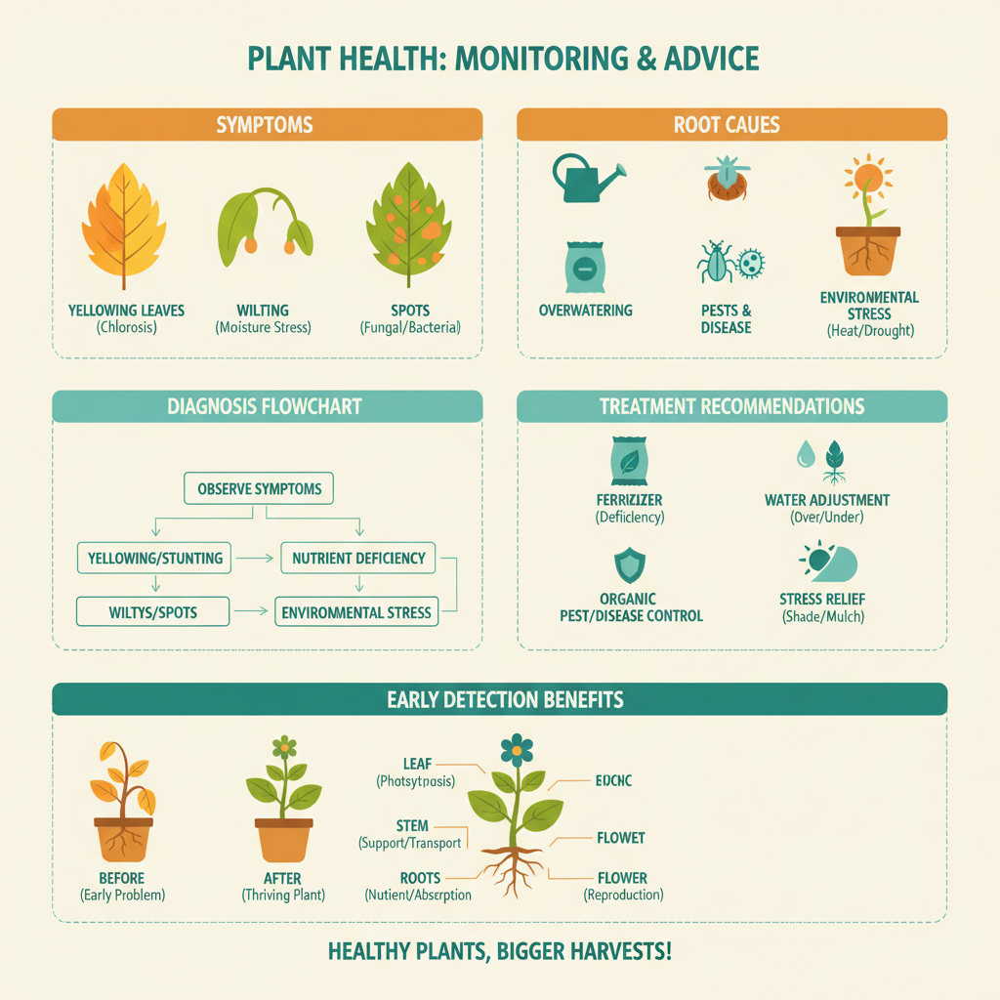

Plant health monitoring and advice for gardens and small farms, providing early detection of nutrient deficiencies, pests, and disease.

**Capabilities:**
- Early detection of nutrient deficiencies
- Pest and disease identification
- Treatment recommendations
- Plant anatomy understanding
- Diagnosis flowcharts from symptoms
- Organic solutions
- Growth stage monitoring

**Use Case:** Gardeners and small farmers receive early plant health alerts (yellowing leaves, wilting, spots) with specific diagnosis and treatment recommendations before damage becomes severe.

---

#### 22. Grow Timing Calendar

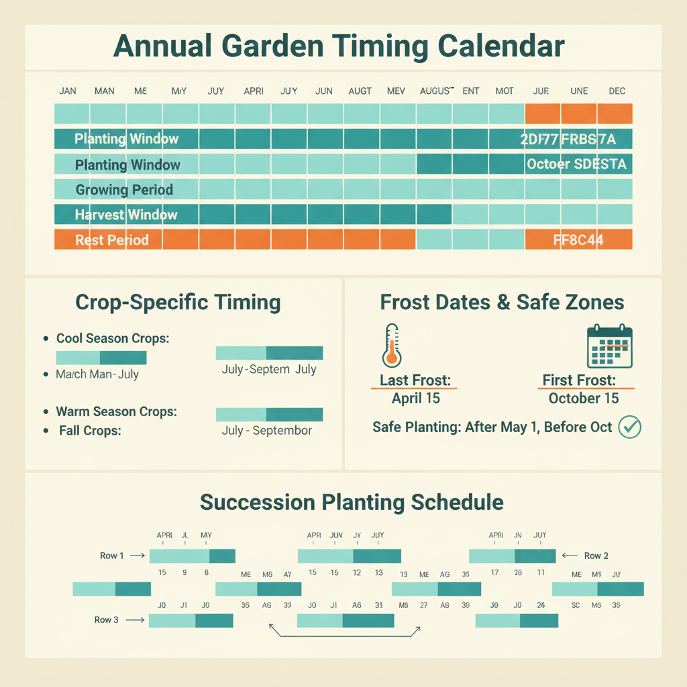

Growth and harvest timing calendar for optimal planting and harvesting, showing frost dates, growing windows, and succession planting schedules.

**Capabilities:**
- Full year calendar with planting windows
- Growing period tracking
- Harvest window identification
- Frost date tracking (last frost, first frost)
- Succession planting schedules
- Crop-specific timing (cool/warm season crops)
- Extended season optimization

**Use Case:** Farmers optimize planting and harvest timing based on frost dates, growing windows, and succession planting, maximizing yield and extending production periods.

---

#### 23. Garden Layout Optimizer

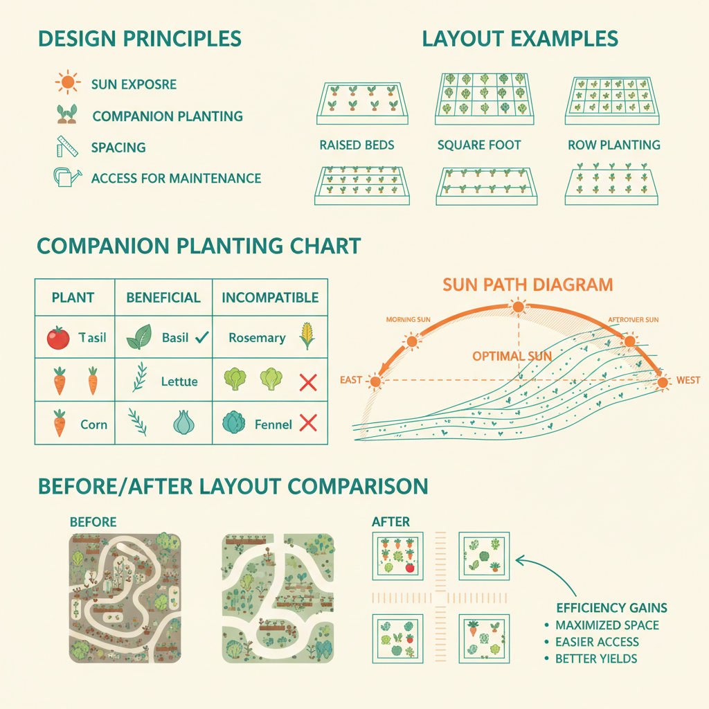

Optimize garden layouts for efficiency and productivity using companion planting, sun exposure analysis, and spacing optimization.

**Capabilities:**
- Design principle optimization (sun exposure, companion planting, spacing, access)
- Layout examples (raised beds, square foot, row, contour)
- Companion planting charts
- Sun path diagrams
- Efficiency gain comparisons
- Plant compatibility analysis
- Optimal bed placement

**Use Case:** Gardeners optimize layouts for efficiency using companion planting relationships, sun exposure analysis, and proper spacing, reducing work and increasing yields.

---

#### 24. Harvest Preservation Guide

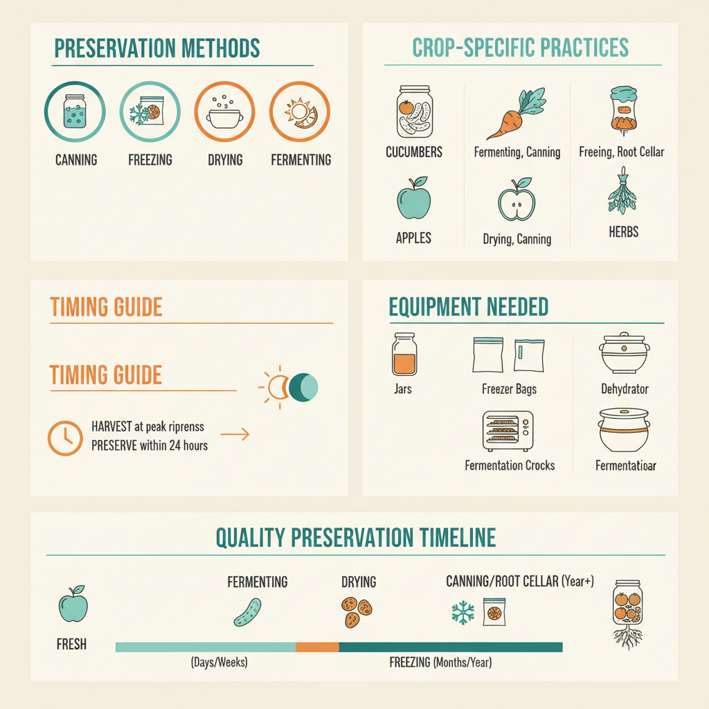

Food preservation techniques and timing for extending harvest bounty, covering canning, freezing, drying, fermenting, and root cellaring.

**Capabilities:**
- Multiple preservation methods (canning, freezing, drying, fermenting, root cellar)
- Crop-specific best practices
- Harvest timing at peak ripeness
- Equipment requirements (jars, freezer bags, dehydrator, fermentation crocks)
- Quality preservation timelines
- Shelf life optimization
- Food safety guidance

**Use Case:** Farmers extend harvest bounty by preserving at peak quality using various methods, reducing waste and ensuring year-round food availability.

---

#### 25. Soil Health Builder

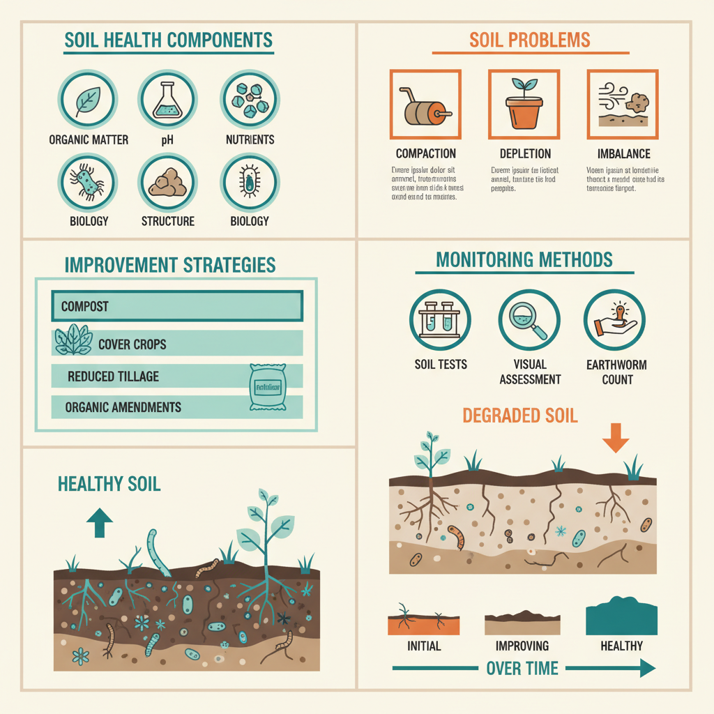

Build and maintain healthy soil for sustainable agriculture using compost, cover crops, reduced tillage, and organic amendments.

**Capabilities:**
- Track soil health components (organic matter, pH, nutrients, structure, biology)
- Identify soil problems (compaction, depletion, imbalance, erosion)
- Improvement strategies (compost, cover crops, reduced tillage, organic amendments)
- Monitoring methods (soil tests, visual assessment, earthworm count)
- Healthy vs degraded soil comparisons
- Long-term soil building plans

**Use Case:** Farmers build and maintain healthy soil through targeted improvements (compost, cover crops, reduced tillage) to reverse degradation and restore productivity sustainably.

---

#### 26. Seed Sovereignty Guide

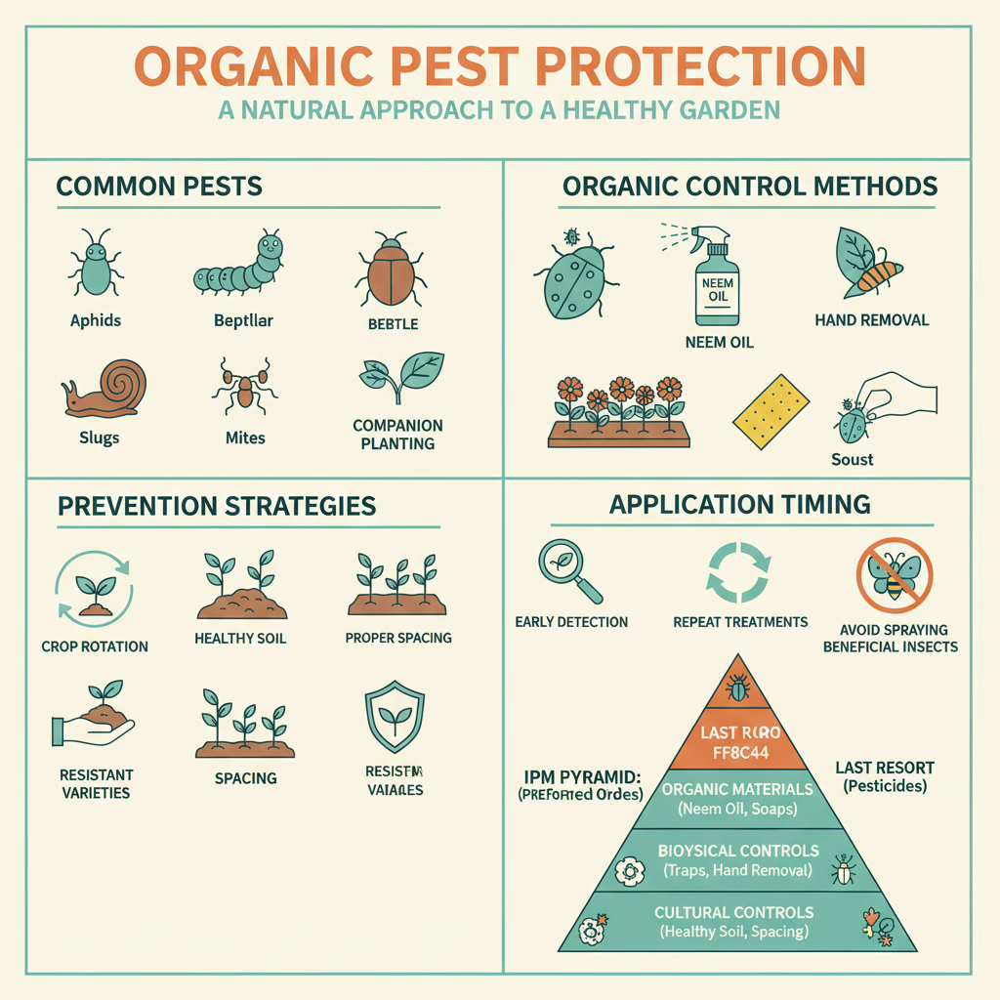

Seed saving and sovereignty guidance for independence, explaining heirloom varieties, open-pollinated seed types, and cost savings from saving seeds.

**Capabilities:**
- Seed type education (heirloom, open-pollinated, hybrid, GM)
- Seed saving techniques (dry seeds, wet seeds, biennials)
- Storage requirements (dry, cool, dark, labeled)
- Cost savings calculations
- Variety preservation
- Adaptation benefits
- Independence from seed companies

**Use Case:** Farmers save seeds from heirloom and open-pollinated varieties, achieving annual cost savings and variety preservation while building seed independence.

---

#### 27. Pest Protector Organic

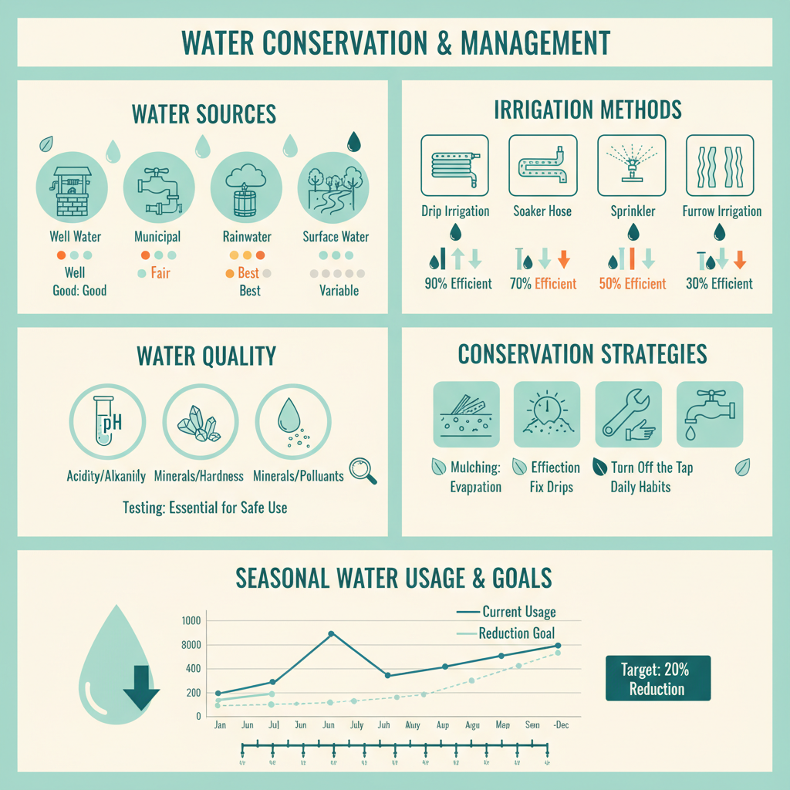

Organic pest protection strategies for sustainable pest management using beneficial insects, neem oil, companion planting, and integrated pest management.

**Capabilities:**
- Common pest identification (aphids, caterpillars, beetles, mites, slugs)
- Organic control methods (beneficial insects, neem oil, companion planting, traps, hand removal)
- Prevention strategies (crop rotation, healthy soil, proper spacing, resistant varieties)
- Application timing (early detection, repeat treatments, avoid spraying beneficials)
- IPM pyramid interventions
- Sustainable pest management

**Use Case:** Farmers protect crops organically using beneficial insects, neem oil, and integrated pest management instead of harmful chemical pesticides, maintaining ecosystem health while controlling pests.

---

#### 28. Water Wisdom Helper

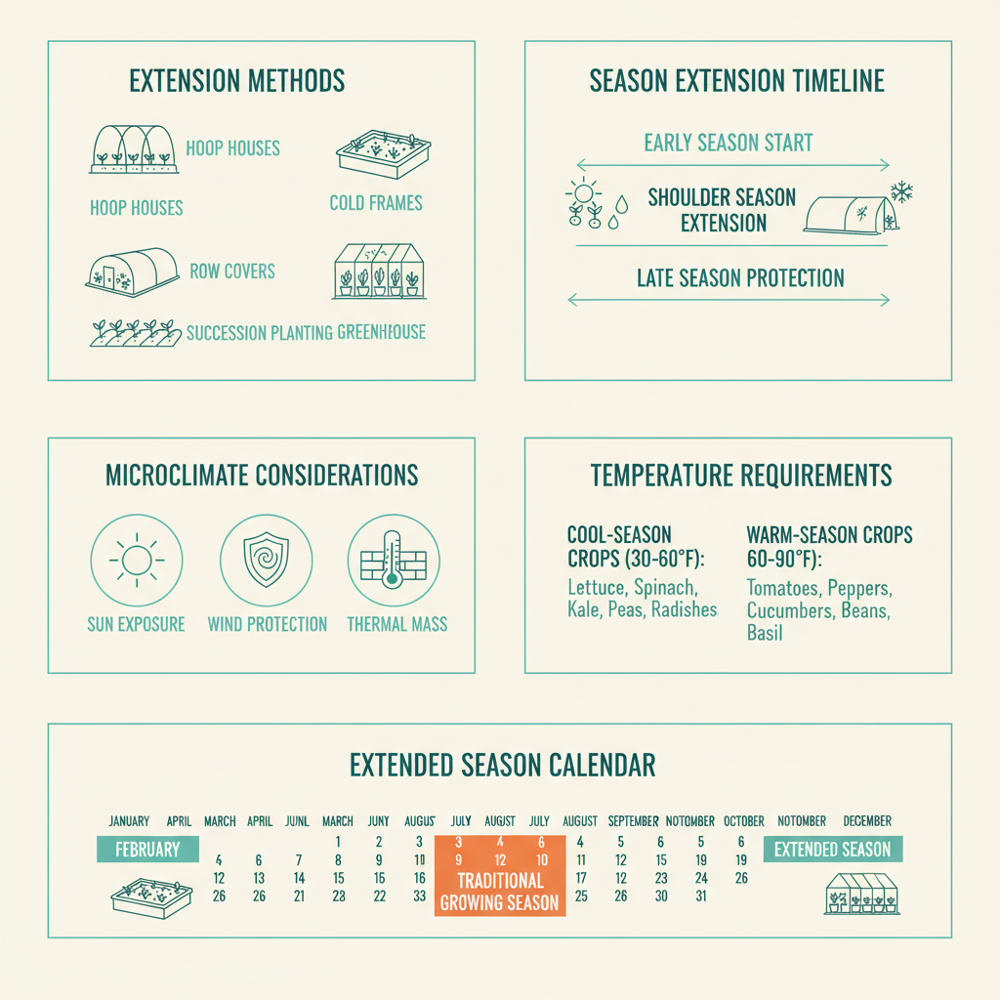

Water conservation and management for sustainable agriculture, covering irrigation efficiency, water quality, and conservation strategies.

**Capabilities:**
- Water source identification (well, municipal, rainwater, surface water)
- Irrigation methods (drip, soaker hose, sprinkler, furrow)
- Irrigation efficiency percentages
- Water quality factors (pH, minerals, contaminants) and testing
- Conservation strategies (mulching, efficient scheduling, leak detection)
- Seasonal usage patterns
- Reduction goals and tracking

**Use Case:** Farmers optimize water management using efficient irrigation, quality testing, and conservation strategies, reducing water waste and ensuring sustainable agricultural water use.

---

#### 29. Season Extension Planner

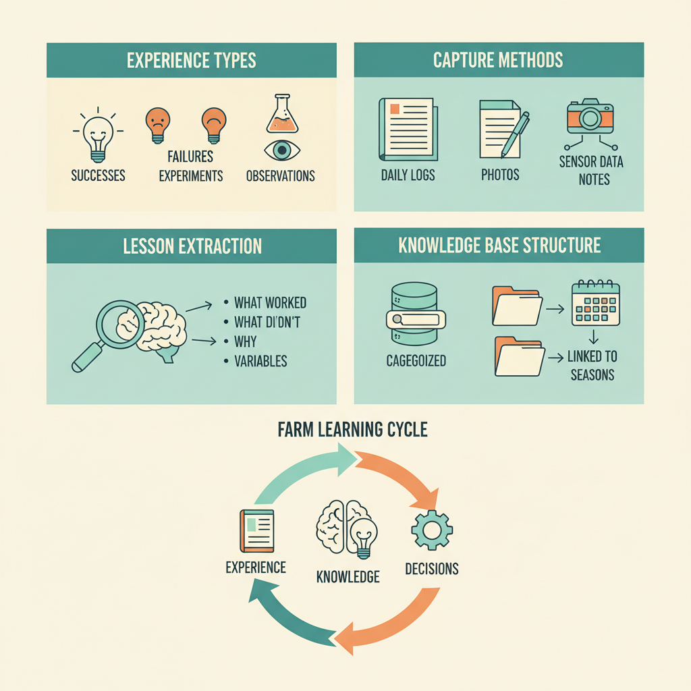

Extend growing seasons with techniques and planning using hoop houses, cold frames, row covers, and succession planting.

**Capabilities:**
- Extension methods (hoop houses, cold frames, row covers, greenhouse, succession planting)
- Season extension timeline (early season start, shoulder season extension, late season protection)
- Microclimate considerations (sun exposure, wind protection, thermal mass)
- Temperature requirements for common crops
- Extended season calendar
- Structure building guidance

**Use Case:** Farmers extend growing seasons by 1-3 months using simple structures (cold frames, row covers, hoop houses) and succession planting, maximizing production periods.

---

#### 30. Learning From Experience


Track and learn from farm experiences for continuous improvement, capturing successes, failures, experiments, and observations.

**Capabilities:**
- Experience tracking (successes, failures, experiments, observations)
- Multiple capture methods (daily logs, photos, notes, sensor data)
- Lesson extraction (what worked, what didn't, why, variables)
- Knowledge base structure (searchable, categorized, season-linked)
- Continuous improvement cycle
- Institutional memory preservation
- Decision support from past experiences

**Use Case:** Farmers capture and learn from experiences (what worked, what didn't) to build institutional memory and continuously improve decisions based on past successes and failures.

---

## Installation

### Clone Repository

```bash
git clone https://github.com/farmfriend-labs/agent-skills-farming.git
cd agent-skills-farming
```

### Use with FF-Terminal

```bash
# Copy skill to FF-Terminal skills directory
cp -r skills/universal-equipment-translator ~/.ff-terminal/skills/

# Load skill via FF-Terminal
ff-terminal --load-skill universal-equipment-translator
```

### Use with Other Agents

Skills use standard AgentSkills.io format and work with compatible agents:

```bash
# Load skill into agent context
agent --skill ./skills/universal-equipment-translator

# Or copy to agent skills directory
cp -r skills/universal-equipment-translator ~/.agent/skills/
```

---

## Development Guidelines

### Creating a New Skill

1. Create directory: `skills/your-skill-name/`
2. Create `SKILL.md` with proper format
3. Add `.env.example` for any credentials needed
4. Create `scripts/` for any helper utilities
5. Add `examples/` with usage scenarios
6. Document `references/` with supporting materials
7. Add skill to this README under appropriate category

### Skill Requirements

- **SKILL.md**: Required - defines skill behavior
- **.env.example**: Required if skill uses credentials/APIs
- **scripts/**: Optional - helper scripts
- **examples/**: Optional - usage examples
- **references/**: Optional - documentation
- **resources/**: Optional - templates, configs

### Environment Variables

- Use `.env.example` to document required variables
- Add `.env` to `.gitignore` (never commit credentials)
- Provide clear instructions in SKILL.md for setup

---

## Contributing

We welcome contributions! To add a skill:

1. Fork this repository
2. Create a new skill directory following the structure above
3. Add skill to README under appropriate category
4. Submit a pull request

Guidelines:
- Skills must work offline whenever possible
- Use plain language, no jargon
- Include clear setup instructions
- Document all environment variables
- Provide working examples

---

## License

MIT License - Open source, free to use, modify, and distribute.

### What This Means

- Use skills for personal or commercial farming
- Modify skills for your specific needs
- Distribute modified versions
- Include attribution to original authors
- No warranty, use at your own risk

---

## Support

### Documentation

See [FF-Docs](https://github.com/farmfriend-labs/ff-docs) for detailed guides and tutorials (coming soon).

### Community

Join the discussion in [Issues](https://github.com/farmfriend-labs/agent-skills-farming/issues) or [Discussions](https://github.com/farmfriend-labs/agent-skills-farming/discussions).

### Contact

- Email: farmfriend.labs@gmail.com
- Website: https://farm-friend.com
- Location: Cedar Creek, TX

---

## Related Projects

- [FF-Terminal](https://github.com/farmfriend-labs/ff-terminal) - Autonomous AI terminal (coming soon)
- [FF-Agriculture](https://github.com/farmfriend-labs/ff-agriculture) - Farm automation platform (planned)
- [FF-JADAM](https://github.com/farmfriend-labs/ff-jadam) - JADAM natural farming implementation (planned)

---

## Acknowledgments

- JADAM methods from Youngsang Cho and JADAM Global
- AgentSkills.io format specification
- FarmFriend Terminal Labs community contributors
- Open source agricultural technology community

---

FarmFriend Terminal Labs - Open Source Skills for Farmers
